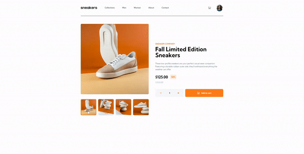
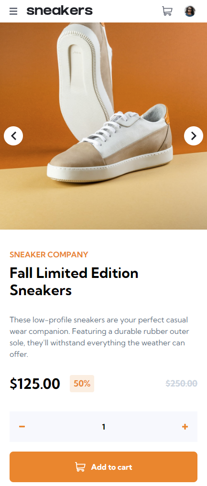
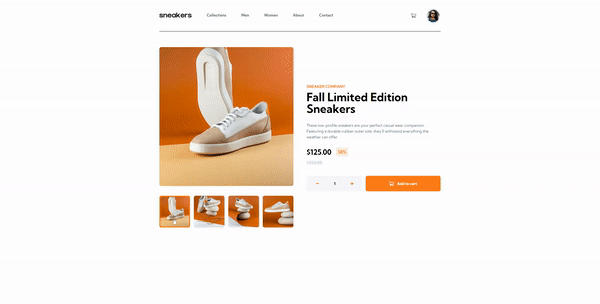

## Description

A sleek UI for an ecommerce product page complete with a lightbox modal, cart functionality, product image gallery, and responsive design. Built using React and Tailwindcss. The app design and assets were provided by frontend mentor, but entirely coded by myself.

[Try the live demo!](https://ecommerce-page-d5cfb.web.app/)

## Screenshots

## Quick Demo

## Available Scripts

In the project directory, you can run:

### `npm start start`

Runs the app in the development mode.
Open [http://localhost:3000](http://localhost:3000) to view it in your browser.
